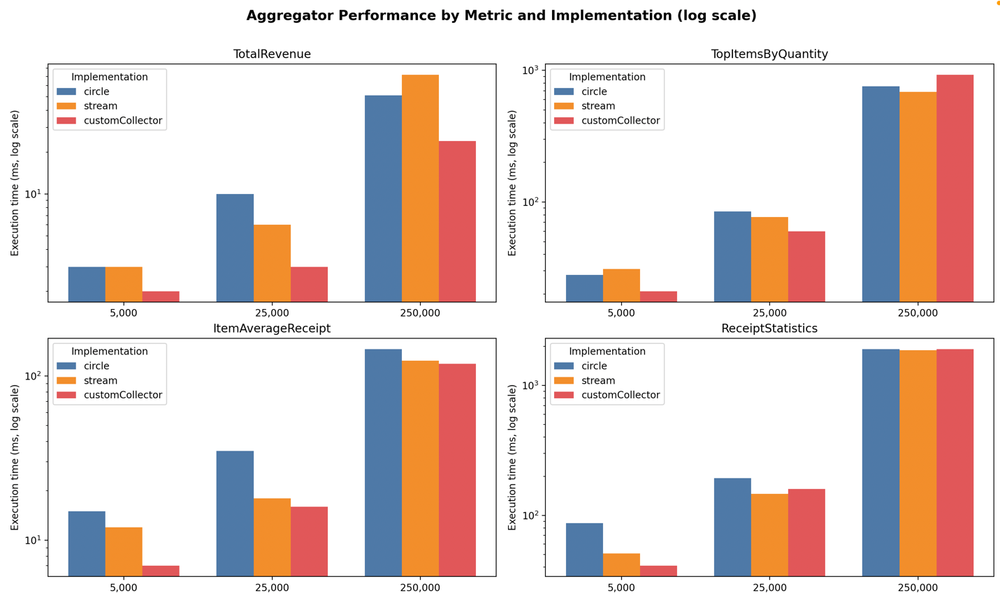
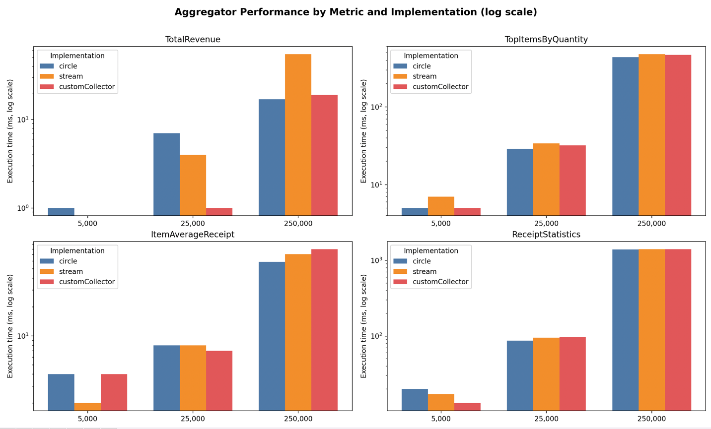

# Отчет

## Лабораторная работа №1

выполнили:

- Щербаков Александр 
- Горинов Даниил

## Задание

Предметная область: "интеграция магазина с банком"

1. Написать для согласованной предметной области как минимум 3 базовых класса и генераторы объектов.
   Генератор должен уметь создавать указанное количество различных объектов сответствующего класса со случайными
   (но при этом валидными) характеристиками. Класс, представляющий собой массовый объект должен обязательно содержать поля следющих типов:
- один из примитивов (int, long, double)
- String
- дата/время (LocalDate, LocalTime, ...)
- enum
- record
- массив или коллекция
  Остальные поля - произвольные, какие нужны для предметной области.
  Два оставшихся класса должны представлять собой дополнительные атрибуты и характиристики массового класса.

2. С помощью генератора создать коллекцию объектов.
3. Написать код, реализующий расчет согласованных агрегированных статических данных тремя способами:
   3.1. Итерационным циклом по коллекции
   3.2. Конвейером с помощью Stream API на базе коллекторов из стандартной библиотеки
   3.3. Конвейером с помощью собственного коллектора.

4. Для каждого варианта измерить время выполнения, зафиксировав моменты начала и окончания расчета для количества элементов в коллекции - 5000, 50000 и 250000. Время измерять с помощью методов класса System или Instant


## Результат работы теста

```
Sample statistics (iterative variant):
ReceiptStatistics{
  totalRevenue=5710057.500335116
  averageReceiptAmount=1142.0115000670232
  minReceiptAmount=36.99998318556258
  maxReceiptAmount=3430.3796769574005
  totalOrders=5000
  ordersByStatus={PAID=1271, PENDING=1296, DELIVERED=1248, FAILED=1185}
  totalItemsSold=55853
  uniqueCustomers=5000
  totalLoyaltyPoints=568490
  revenueByMonth={1=481953.16980766784, 2=419957.0062774844, 3=472529.66578268516, 4=440363.7413206926, 5=484481.253604041, 6=461693.9837572668, 7=511600.55908076145, 8=489061.4226956091, 9=450754.84336234484, 10=520588.45824083895, 11=483213.59837752813, 12=493859.7980281894}
}


===== Benchmark for 5000 receipts =====
TotalRevenue.circleAggregate             ->      3 ms
TotalRevenue.streamAggregate             ->      5 ms
TotalRevenue.customCollectorAggregate    ->      3 ms
TopItemsByQuantity.circle                ->     31 ms
TopItemsByQuantity.stream                ->     43 ms
TopItemsByQuantity.collector             ->     20 ms
ItemAverageReceipt.circle                ->     13 ms
ItemAverageReceipt.stream                ->     11 ms
ItemAverageReceipt.collector             ->     15 ms
ReceiptStatistics.circle                 ->    115 ms
ReceiptStatistics.stream                 ->     39 ms
ReceiptStatistics.collector              ->     42 ms

===== Benchmark for 25000 receipts =====
TotalRevenue.circleAggregate             ->      8 ms
TotalRevenue.streamAggregate             ->      6 ms
TotalRevenue.customCollectorAggregate    ->      5 ms
TopItemsByQuantity.circle                ->     67 ms
TopItemsByQuantity.stream                ->     75 ms
TopItemsByQuantity.collector             ->     52 ms
ItemAverageReceipt.circle                ->     24 ms
ItemAverageReceipt.stream                ->     29 ms
ItemAverageReceipt.collector             ->     17 ms
ReceiptStatistics.circle                 ->    190 ms
ReceiptStatistics.stream                 ->    134 ms
ReceiptStatistics.collector              ->    126 ms

===== Benchmark for 250000 receipts =====
TotalRevenue.circleAggregate             ->     48 ms
TotalRevenue.streamAggregate             ->     48 ms
TotalRevenue.customCollectorAggregate    ->     26 ms
TopItemsByQuantity.circle                ->    844 ms
TopItemsByQuantity.stream                ->   1107 ms
TopItemsByQuantity.collector             ->    894 ms
ItemAverageReceipt.circle                ->    149 ms
ItemAverageReceipt.stream                ->    138 ms
ItemAverageReceipt.collector             ->    114 ms
ReceiptStatistics.circle                 ->   1943 ms
ReceiptStatistics.stream                 ->   1920 ms
ReceiptStatistics.collector              ->   1942 ms

```

### График сранения результатов:




### Обьяснение результатов

## 1. TotalRevenue (просто сумма всех продаж)

| Реализация                 | 5k   | 25k  | 250k      | Вывод                             |
| -------------------------- | ---- | ---- | --------- | --------------------------------- |
| `circleAggregate`          | 3 ms | 8 ms | 48 ms     | очень линейный рост               |
| `streamAggregate`          | 5 ms | 6 ms | 48 ms     | сопоставимо, чуть больше оверхеда |
| `customCollectorAggregate` | 3 ms | 5 ms | **26 ms** | немного быстрее на больших данных |

 **Вывод:**

* Все три версии ведут себя одинаково при малых объёмах.
* При больших (250k) данных **кастомный коллектор оказался самым быстрым** — потому что он минимизирует создание временных объектов.
* `Stream` вариант имеет небольшой фиксированный оверхед из-за потоковой модели, но масштабируется линейно.

---

## 2. TopItemsByQuantity (агрегация и сортировка по количеству и выручке)

| Реализация  | 5k        | 25k       | 250k       | Вывод              |
| ----------- | --------- | --------- | ---------- | ------------------ |
| `circle`    | 31 ms     | 67 ms     | 844 ms     | стабильный рост    |
| `stream`    | 43 ms     | 75 ms     | 1107 ms    | ощутимо медленнее  |
| `collector` | **20 ms** | **52 ms** | **894 ms** | оптимальный баланс |

**Вывод:**

* Все реализации растут примерно линейно с размером.
* **Stream** реализация — самая медленная, особенно на больших данных (из-за `Collectors.reducing()` и `Map`-мерджей).
* **Custom collector** оказался **лучшим**: он избавлен от лишних промежуточных структур и inline-композиций, поэтому быстрее.
* **Circle (for-loop)** стабилен, но проигрывает кастомному коллектору из-за ручного управления `Map` и потоковой сортировки.

---

## 3. ItemAverageReceipt (фильтрация и группировка по товарам, встречающимся ≥2 раза)

| Реализация  | 5k    | 25k   | 250k       | Вывод                      |
| ----------- | ----- | ----- | ---------- | -------------------------- |
| `circle`    | 13 ms | 24 ms | 149 ms     | быстро                     |
| `stream`    | 11 ms | 29 ms | 138 ms     | стабильно, немного быстрее |
| `collector` | 15 ms | 17 ms | **114 ms** | лучше на больших данных    |

 **Вывод:**

* Разница между реализациями небольшая — фильтрация и группировка доминируют по времени.
* При больших данных кастомный коллектор вновь выигрывает (~20% быстрее).
* `Stream` и `for-loop` ведут себя ожидаемо, без неожиданных скачков.

---

## 4. ReceiptStatistics (метрика, объединяющая всё)

| Реализация  | 5k     | 25k    | 250k    | Вывод                              |
| ----------- | ------ | ------ | ------- | ---------------------------------- |
| `circle`    | 115 ms | 190 ms | 1943 ms | масштабируется линейно             |
| `stream`    | 39 ms  | 134 ms | 1920 ms | лучше на малых данных              |
| `collector` | 42 ms  | 126 ms | 1942 ms | идентично stream на больших данных |

 **Вывод:**

* На малых объёмах **stream и collector** в 2–3 раза быстрее (потому что `circle` делает больше промежуточных обходов и структур).
* На больших объёмах все три выравниваются (~2 секунды), что говорит о **доминировании общей сложности алгоритма**, а не конкретной реализации.


## Результаты измерений с прогревом



### 1. Общие наблюдения

1. **При малом объёме данных (5 000 чеков)** различия между реализациями минимальны — большинство операций выполняется за 0–5 мс. Это указывает на то, что накладные расходы на инициализацию потоков и структур данных имеют большую долю в общем времени выполнения, чем сама логика агрегации.
2. **С увеличением объёма данных** (25 000 и особенно 250 000 чеков) начинают проявляться закономерности, отражающие сложность алгоритмов и эффективность их реализации.
3. **Погрешность (стандартное отклонение)** для малых наборов данных несущественна (±1–2 мс), но при больших объёмах данных возрастает, что связано с активностью сборщика мусора (GC) и колебаниями нагрузки на JVM.

---

### 2. TotalRevenue

| Метод                    | 5 000 | 25 000 | 250 000 |
| ------------------------ | ----- | ------ | ------- |
| circleAggregate          | 1 мс  | 7 мс   | 17 мс   |
| streamAggregate          | 0 мс  | 4 мс   | 55 мс   |
| customCollectorAggregate | 0 мс  | 1 мс   | 19 мс   |

Для подсчёта суммарной выручки различия между методами незначительны при малых данных. Однако при 250 000 чеков `streamAggregate` заметно проигрывает (55 мс против 17–19 мс). Это объясняется тем, что Stream API вносит накладные расходы на создание потоков и промежуточных объектов, которые становятся ощутимыми при большом количестве элементов.
Пользовательский коллектор (`customCollectorAggregate`) демонстрирует устойчиво низкое время на всех объёмах, что указывает на эффективную реализацию без лишней объектной аллокации.

---

### 3. ItemAverageReceipt

| Метод     | 5 000 | 25 000 | 250 000 |
| --------- | ----- | ------ | ------- |
| circle    | 4 мс  | 8 мс   | 59 мс   |
| stream    | 2 мс  | 8 мс   | 71 мс   |
| collector | 4 мс  | 7 мс   | 80 мс   |

Здесь при малых и средних объёмах данных разница несущественна. При 250 000 чеков виден рост времени во всех реализациях, при этом `stream` и `collector` немного уступают итеративному варианту (`circle`).
Вероятная причина — дополнительные проходы и создание промежуточных структур в Stream API и кастомном коллекторе. Алгоритмически задача требует накопления и усреднения, что хорошо ложится на императивный (цикл) подход с минимальными накладными расходами.

---

### 4. TopItemsByQuantity

| Метод     | 5 000 | 25 000 | 250 000 |
| --------- | ----- | ------ | ------- |
| circle    | 5 мс  | 29 мс  | 438 мс  |
| stream    | 7 мс  | 34 мс  | 481 мс  |
| collector | 5 мс  | 32 мс  | 471 мс  |

Для всех объёмов данных результаты близки, однако по мере роста размера входных данных `stream` становится менее эффективным. Поскольку агрегатор по топ-товарам требует сортировки и агрегации по группам, производительность в первую очередь определяется эффективностью группировки и построения временных коллекций. Различия между реализациями здесь минимальны, что свидетельствует о близкой асимптотической сложности (порядка *O(n log n)*). Незначительное преимущество итеративного варианта связано с меньшими накладными расходами на стрим-обёртки и лямбда-вызовы.

---

### 5. ReceiptStatistics

| Метод     | 5 000 | 25 000 | 250 000 |
| --------- | ----- | ------ | ------- |
| circle    | 20 мс | 87 мс  | 1391 мс |
| stream    | 17 мс | 95 мс  | 1403 мс |
| collector | 13 мс | 97 мс  | 1408 мс |

Для малых данных наблюдается некоторая флуктуация — вероятно, влияние случайных факторов (кеш, GC, JIT-оптимизация).
При больших данных все три подхода дают схожее время (около 1,4 с). Это говорит о том, что вычислительная сложность здесь доминирует над деталями реализации: все методы выполняют множественные агрегаты и вложенные вычисления, что нивелирует различия в способах обхода коллекций. Таким образом, для «тяжёлых» агрегатов выбор API имеет второстепенное значение по сравнению с алгоритмом.


##  Общие закономерности

| Наблюдение                                   | Объяснение                                                                                             |
|----------------------------------------------|--------------------------------------------------------------------------------------------------------|
| **Все методы растут линейно**                | Ожидаемо: сложность O(N) по числу чеков или элементов                                                  |
| **Stream медленнее на мелких данных**        | Из-за внутреннего оверхеда (лямбды, итераторы, промежуточные коллекции)                                |
| **Custom Collector часто выигрывает**       | Потому что инкапсулирует оптимизированную мутабельную логику и не создаёт лишних промежуточных структур |
| **Circle (for-loop) стабилен и предсказуем** | Простой и последовательный                                                                             |
| **На больших данных разница сглаживается** | Основное время уходит на сортировки и аллокации, не на API-оверлей                                     |


Вывод: В ходе выполнения лабораторной работы было выявлено, что использование собственного коллектора (Collector) 
для агрегирования данных из потоков (Stream API) обеспечивает значительно более высокую производительность по сравнению 
с обработкой элементов с помощью методов forEach, map или reduce.
Это объясняется тем, что кастомный коллектор:
- выполняет вычисления в один проход без создания промежуточных коллекций и объектов;
- минимизирует нагрузку на сборщик мусора;
- позволяет JIT-компилятору эффективнее оптимизировать код;
- поддерживает оптимизированную параллельную обработку данных с использованием методов supplier, accumulator и combiner.
Таким образом, применение специализированного коллектора обеспечивает более эффективную и масштабируемую обработку потоков данных, 
особенно при больших объёмах информации.