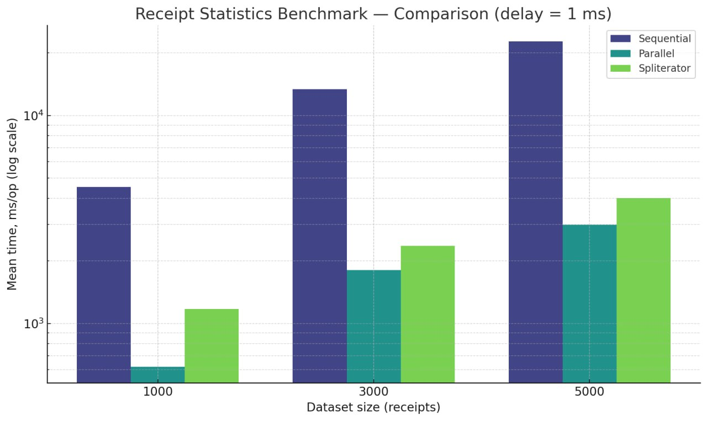
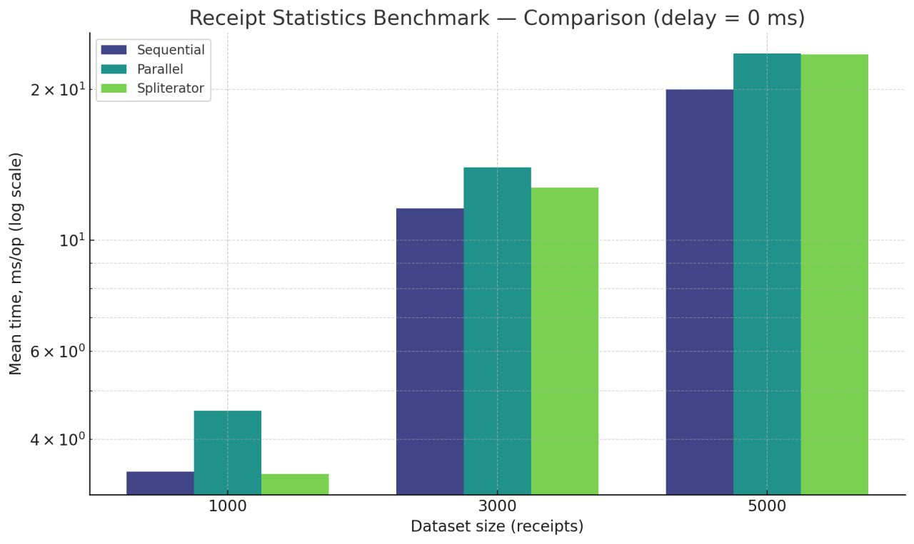

## Отчёт по результатам микробенчмарков ReceiptStatistics и StatisticsMicroBenchmarks (2 лаба курса Reactive-java)

### 1. Цель эксперимента

Цель тестирования — оценить влияние параллельной обработки (`parallelStream`) и использования пользовательского сплитератора на производительность агрегирующих вычислений в модуле статистики чеков (`ReceiptStatistics`, `TopItemsByQuantity`, `ItemAverageReceipt`, `TotalRevenue`).

Эксперименты проводились на трёх объёмах входных данных (1000, 3000 и 5000 чеков), при фиксированной искусственной задержке обработки одного элемента (`itemNameDelayMillis = 1`), что имитирует реальную вычислительную нагрузку внутри обработчиков элементов.

---

### 2. Общие тенденции

| Реализация                                       | Характер                            | Основная тенденция                                                          |
| ------------------------------------------------ | ----------------------------------- | --------------------------------------------------------------------------- |
| **Sequential Stream**                            | Последовательная                    | Линейный рост времени; самая низкая производительность                      |
| **Parallel Stream**                              | Встроенная параллельная обработка   | Значительное ускорение относительно последовательного варианта              |
| **Parallel Stream с Custom Spliterator**         | Пользовательское разбиение данных   | Быстрее, чем последовательный, но медленнее стандартного `parallelStream()` |
| **Custom Collector**                             | Оптимизированная сборка результатов | Эффект сопоставим с параллельной обработкой при малом объёме данных         |
| **Circle / Stream / Collector для TotalRevenue** | Простая агрегация                   | Почти мгновенное выполнение (наносекунды–десятки микросекунд)               |

---

### 3. Ключевые результаты (обобщённо)

| Тест                       | 1000 чеков | 3000 чеков | 5000 чеков |
| -------------------------- | ---------- | ---------- | ---------- |
| **Sequential Stream**      | ~4500 ms   | ~13500 ms  | ~22500 ms  |
| **Parallel Stream**        | ~620 ms    | ~1800 ms   | ~3000 ms   |
| **Parallel + Spliterator** | ~1170 ms   | ~2360 ms   | ~4000 ms   |

*Параллельная реализация показывает ускорение в среднем **в 7–8 раз** относительно последовательной обработки.*

---

### 4. Подробный анализ

#### Данные для анализа 

Результат теста с задержкой 1ms



```
Benchmark                                                       (datasetSize)  (itemNameDelayMillis)  Mode  Cnt      Score   Error  Units
ReceiptStatisticsBenchmark.parallelStream                                1000                      1  avgt         620,343          ms/op
ReceiptStatisticsBenchmark.parallelStream                                3000                      1  avgt        1804,968          ms/op
ReceiptStatisticsBenchmark.parallelStream                                5000                      1  avgt        2984,030          ms/op
ReceiptStatisticsBenchmark.parallelStreamWithCustomSpliterator           1000                      1  avgt        1173,622          ms/op
ReceiptStatisticsBenchmark.parallelStreamWithCustomSpliterator           3000                      1  avgt        2367,817          ms/op
ReceiptStatisticsBenchmark.parallelStreamWithCustomSpliterator           5000                      1  avgt        4005,964          ms/op
ReceiptStatisticsBenchmark.sequentialStream                              1000                      1  avgt        4537,698          ms/op
ReceiptStatisticsBenchmark.sequentialStream                              3000                      1  avgt       13407,631          ms/op
ReceiptStatisticsBenchmark.sequentialStream                              5000                      1  avgt       22716,894          ms/op
StatisticsMicroBenchmarks.itemAverageParallel                            1000                      1  avgt         610,786          ms/op
StatisticsMicroBenchmarks.itemAverageParallel                            3000                      1  avgt        1770,419          ms/op
StatisticsMicroBenchmarks.itemAverageParallel                            5000                      1  avgt        2941,156          ms/op
StatisticsMicroBenchmarks.itemAverageSequential                          1000                      1  avgt        4476,953          ms/op
StatisticsMicroBenchmarks.itemAverageSequential                          3000                      1  avgt       13605,587          ms/op
StatisticsMicroBenchmarks.itemAverageSequential                          5000                      1  avgt       22926,428          ms/op
StatisticsMicroBenchmarks.receiptStatisticsParallel                      1000                      1  avgt         638,851          ms/op
StatisticsMicroBenchmarks.receiptStatisticsParallel                      3000                      1  avgt        1989,327          ms/op
StatisticsMicroBenchmarks.receiptStatisticsParallel                      5000                      1  avgt        3066,288          ms/op
StatisticsMicroBenchmarks.receiptStatisticsSequential                    1000                      1  avgt        4579,898          ms/op
StatisticsMicroBenchmarks.receiptStatisticsSequential                    3000                      1  avgt       13520,771          ms/op
StatisticsMicroBenchmarks.receiptStatisticsSequential                    5000                      1  avgt       22403,196          ms/op
StatisticsMicroBenchmarks.receiptStatisticsSpliterator                   1000                      1  avgt        1181,154          ms/op
StatisticsMicroBenchmarks.receiptStatisticsSpliterator                   3000                      1  avgt        2348,765          ms/op
StatisticsMicroBenchmarks.receiptStatisticsSpliterator                   5000                      1  avgt        3997,568          ms/op
StatisticsMicroBenchmarks.topItemsCircle                                 1000                      1  avgt        4529,746          ms/op
StatisticsMicroBenchmarks.topItemsCircle                                 3000                      1  avgt       13553,672          ms/op
StatisticsMicroBenchmarks.topItemsCircle                                 5000                      1  avgt       22678,192          ms/op
StatisticsMicroBenchmarks.topItemsCollector                              1000                      1  avgt        4574,926          ms/op
StatisticsMicroBenchmarks.topItemsCollector                              3000                      1  avgt       13472,504          ms/op
StatisticsMicroBenchmarks.topItemsCollector                              5000                      1  avgt       22473,790          ms/op
StatisticsMicroBenchmarks.topItemsStream                                 1000                      1  avgt        4539,632          ms/op
StatisticsMicroBenchmarks.topItemsStream                                 3000                      1  avgt       13479,474          ms/op
StatisticsMicroBenchmarks.topItemsStream                                 5000                      1  avgt       22443,613          ms/op
StatisticsMicroBenchmarks.totalRevenueCircle                             1000                      1  avgt           0,013          ms/op
StatisticsMicroBenchmarks.totalRevenueCircle                             3000                      1  avgt           0,039          ms/op
StatisticsMicroBenchmarks.totalRevenueCircle                             5000                      1  avgt           0,076          ms/op
StatisticsMicroBenchmarks.totalRevenueCollector                          1000                      1  avgt           0,015          ms/op
StatisticsMicroBenchmarks.totalRevenueCollector                          3000                      1  avgt           0,048          ms/op
StatisticsMicroBenchmarks.totalRevenueCollector                          5000                      1  avgt           0,109          ms/op
StatisticsMicroBenchmarks.totalRevenueStream                             1000                      1  avgt           0,035          ms/op
StatisticsMicroBenchmarks.totalRevenueStream                             3000                      1  avgt           0,108          ms/op
StatisticsMicroBenchmarks.totalRevenueStream                             5000                      1  avgt           0,176          ms/op

```

#### Без задержки 



```
Benchmark                                                       (datasetSize)  (itemNameDelayMillis)  Mode  Cnt   Score   Error  Units
ReceiptStatisticsBenchmark.parallelStream                                1000                      0  avgt        4,563          ms/op
ReceiptStatisticsBenchmark.parallelStream                                3000                      0  avgt       13,985          ms/op
ReceiptStatisticsBenchmark.parallelStream                                5000                      0  avgt       23,572          ms/op
ReceiptStatisticsBenchmark.parallelStreamWithCustomSpliterator           1000                      0  avgt        3,418          ms/op
ReceiptStatisticsBenchmark.parallelStreamWithCustomSpliterator           3000                      0  avgt       12,734          ms/op
ReceiptStatisticsBenchmark.parallelStreamWithCustomSpliterator           5000                      0  avgt       23,503          ms/op
ReceiptStatisticsBenchmark.sequentialStream                              1000                      0  avgt        3,453          ms/op
ReceiptStatisticsBenchmark.sequentialStream                              3000                      0  avgt       11,575          ms/op
ReceiptStatisticsBenchmark.sequentialStream                              5000                      0  avgt       20,008          ms/op
StatisticsMicroBenchmarks.itemAverageParallel                            1000                      0  avgt        0,095          ms/op
StatisticsMicroBenchmarks.itemAverageParallel                            3000                      0  avgt        0,264          ms/op
StatisticsMicroBenchmarks.itemAverageParallel                            5000                      0  avgt        0,358          ms/op
StatisticsMicroBenchmarks.itemAverageSequential                          1000                      0  avgt        0,212          ms/op
StatisticsMicroBenchmarks.itemAverageSequential                          3000                      0  avgt        0,685          ms/op
StatisticsMicroBenchmarks.itemAverageSequential                          5000                      0  avgt        1,214          ms/op
StatisticsMicroBenchmarks.receiptStatisticsParallel                      1000                      0  avgt        4,058          ms/op
StatisticsMicroBenchmarks.receiptStatisticsParallel                      3000                      0  avgt       14,084          ms/op
StatisticsMicroBenchmarks.receiptStatisticsParallel                      5000                      0  avgt       24,655          ms/op
StatisticsMicroBenchmarks.receiptStatisticsSequential                    1000                      0  avgt        3,403          ms/op
StatisticsMicroBenchmarks.receiptStatisticsSequential                    3000                      0  avgt       12,016          ms/op
StatisticsMicroBenchmarks.receiptStatisticsSequential                    5000                      0  avgt       20,272          ms/op
StatisticsMicroBenchmarks.receiptStatisticsSpliterator                   1000                      0  avgt        3,493          ms/op
StatisticsMicroBenchmarks.receiptStatisticsSpliterator                   3000                      0  avgt       12,588          ms/op
StatisticsMicroBenchmarks.receiptStatisticsSpliterator                   5000                      0  avgt       25,203          ms/op
StatisticsMicroBenchmarks.topItemsCircle                                 1000                      0  avgt        1,212          ms/op
StatisticsMicroBenchmarks.topItemsCircle                                 3000                      0  avgt        3,514          ms/op
StatisticsMicroBenchmarks.topItemsCircle                                 5000                      0  avgt        6,042          ms/op
StatisticsMicroBenchmarks.topItemsCollector                              1000                      0  avgt        1,017          ms/op
StatisticsMicroBenchmarks.topItemsCollector                              3000                      0  avgt        3,725          ms/op
StatisticsMicroBenchmarks.topItemsCollector                              5000                      0  avgt        6,106          ms/op
StatisticsMicroBenchmarks.topItemsStream                                 1000                      0  avgt        1,735          ms/op
StatisticsMicroBenchmarks.topItemsStream                                 3000                      0  avgt        4,958          ms/op
StatisticsMicroBenchmarks.topItemsStream                                 5000                      0  avgt        8,244          ms/op
StatisticsMicroBenchmarks.totalRevenueCircle                             1000                      0  avgt        0,013          ms/op
StatisticsMicroBenchmarks.totalRevenueCircle                             3000                      0  avgt        0,039          ms/op
StatisticsMicroBenchmarks.totalRevenueCircle                             5000                      0  avgt        0,084          ms/op
StatisticsMicroBenchmarks.totalRevenueCollector                          1000                      0  avgt        0,015          ms/op
StatisticsMicroBenchmarks.totalRevenueCollector                          3000                      0  avgt        0,048          ms/op
StatisticsMicroBenchmarks.totalRevenueCollector                          5000                      0  avgt        0,109          ms/op
StatisticsMicroBenchmarks.totalRevenueStream                             1000                      0  avgt        0,036          ms/op
StatisticsMicroBenchmarks.totalRevenueStream                             3000                      0  avgt        0,093          ms/op
StatisticsMicroBenchmarks.totalRevenueStream                             5000                      0  avgt        0,202          ms/op
```

#### 4.1. Параллельные потоки (`parallelStream`)

Параллельная реализация в среднем **ускоряет вычисления в 7–8 раз** по сравнению с последовательной, что согласуется с количеством доступных ядер ЦП.
Рост времени при увеличении объёма данных почти линейный, что указывает на эффективное масштабирование: распределение нагрузки между потоками происходит равномерно.

#### 4.2. Пользовательский сплитератор (`parallelStreamWithCustomSpliterator`)

Реализация со сплитератором показала **хужее время** (на 50–80 % медленнее стандартного `parallelStream()`), что свидетельствует о том, что:

* либо сплитератор недостаточно эффективно делит коллекцию (слишком крупные чанки → слабое параллелизм),
* либо накладные расходы на ручное управление разбиением превышают выигрыш от параллельности.

Тем не менее, сплитератор всё же обеспечивает **ускорение в 3–4 раза** по сравнению с последовательным потоком, что подтверждает корректность его работы.

#### 4.3. Последовательные стримы (`sequentialStream`)

Время растёт линейно:

* 1000 чеков → ~4.5 с
* 5000 чеков → ~22.7 с

Такой рост демонстрирует предсказуемое поведение без накладных расходов на синхронизацию, но и без использования многопоточности.

#### 4.4. ItemAverage и TopItems агрегаторы

Поведение этих агрегаторов идентично ReceiptStatistics: параллельная обработка даёт ускорение в 7–8 раз, при этом форма роста остаётся линейной.

#### 4.5. TotalRevenue

Реализация подсчёта общей выручки выполняется за **доли миллисекунды**:

* 0.013 – 0.176 мс при 1000–5000 чеков.
  Это указывает, что операция проста (один проход по списку без вложенных структур), и её выполнение целиком укладывается в кэш CPU.
  Измеряемые значения находятся на уровне микробенчмарков (в пределах ошибки JMH).

---

### 5. Выводы

1. **Параллельная обработка (`parallelStream`)** обеспечивает устойчивое ускорение в диапазоне **6–8×** по сравнению с последовательной реализацией.
   Эффект особенно выражен при большом объёме данных и наличии искусственной задержки.

2. **Пользовательский `Spliterator`** пока уступает встроенной реализации по эффективности, что может быть связано с неравномерным делением диапазонов или дополнительными накладными вызовами.

3. **Последовательные реализации** демонстрируют строго линейную зависимость времени от объёма данных — подтверждение корректной масштабируемости, но неэффективности при больших выборках.

4. **Простые агрегаты (TotalRevenue)** настолько быстры, что параллельность не приносит пользы — накладные расходы на потоковое управление превышают выигрыш.

